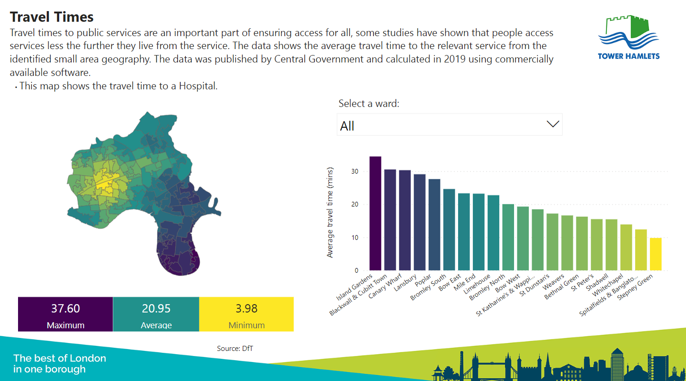
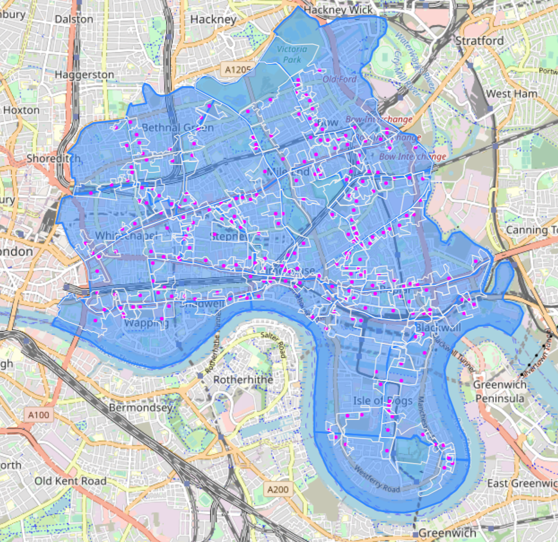

# borough-data-explorer

[](https://data-hamlets.github.io/open-data-tower-hamlets/borough-data-explorer/)

this project contains: 

```sh
├── docs
├── CHANGELOG - git log --pretty=reference
├── LICENSE - AGPLv3
├── README.md
├── boundaries - topojson custom maps
├── data - online sources ensures "scheduled refresh" works online
├── style - viridis palette
├── ward-dashboard.pbit - pbi template
├── ward-dashboard.pbix - pbi report
└── ward-dashboard - report extracted to text sources (powerquery etc)
```
## version controls

this project uses [pbi.tools](https://pbi.tools) and the following commands have been really handy for getting this product onto a sustainable footing:

`pbi-tools extract ward-dashboard.pbix`

> Extract the contents of a PBIX/PBIT file into a folder structure suitable for source control.

...you can then work on powerquery directly in a code editor, useful for managing complex products where you need to find/replace across multiple pages.

`pbi-tools compile ward-dashboard -overwrite -format PBIT`

> re-compile a PBIT file from modified sources in the specified folder

...having fixed up your powerqueries, you can recompile these back into a PBIT, which in turn you can open in pbi, ready to save as a PBIX report...

`pbi-tools launch-pbi ward-dashboard.pbit`

> open a pbit in pbi

...this file can then be saved as pbix format and published!

### bonus section

`pbi-tools extract-pbidesktop <installerPath>   - Extracts binaries from latest installer`

> this extracts the binary from an [official installer](https://github.com/microsoft/winget-pkgs/tree/4f5c3107c67f67ab682d72b7c3825a9a8d1f48cd/manifests/m/Microsoft/PowerBI), giving you the latest tool (nb, rule out intermediary exploits with: `certutil.exe -hashfile PBIDesktopSetup_x64.exe SHA256` to verify [checksums match](https://github.com/microsoft/winget-pkgs/blob/4f5c3107c67f67ab682d72b7c3825a9a8d1f48cd/manifests/m/Microsoft/PowerBI/2.120.963.0/Microsoft.PowerBI.installer.yaml#L25)) between the released/downloaded file

## _note on statistical/political geographies_
> they don't line up

currently we are using 2021 output areas (where possible), these are the smallest unit of aggregation, and can be fairly accurately assigned to wards, although there are many [OAs that don't fit perfectly](https://nbviewer.org/github/data-hamlets/census-data/blob/main/notebooks/0.2-lbth-oa-ward-overlaps.ipynb). 


